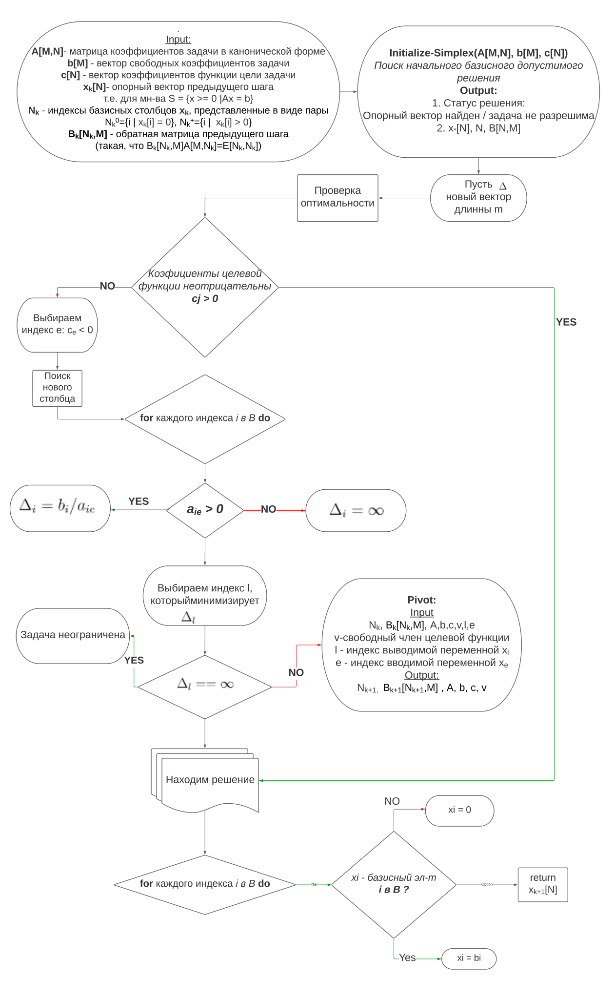
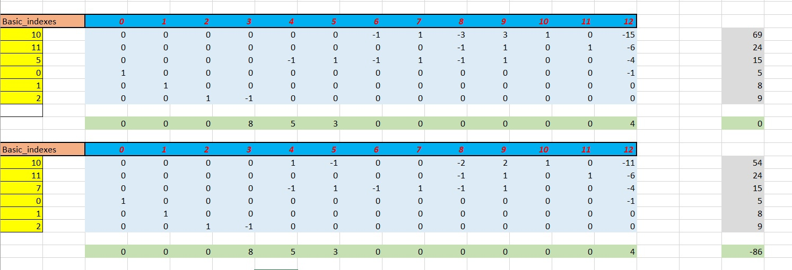
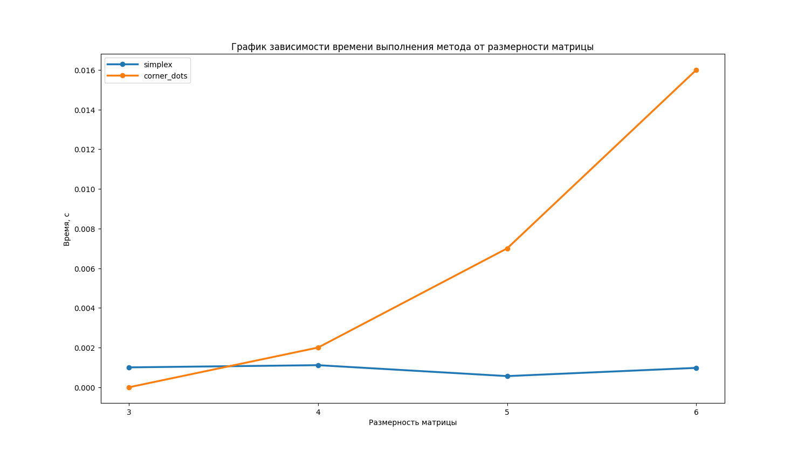
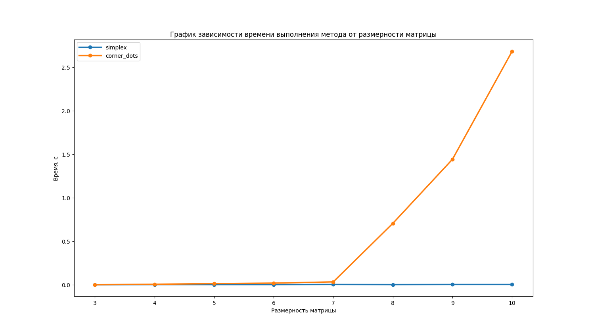
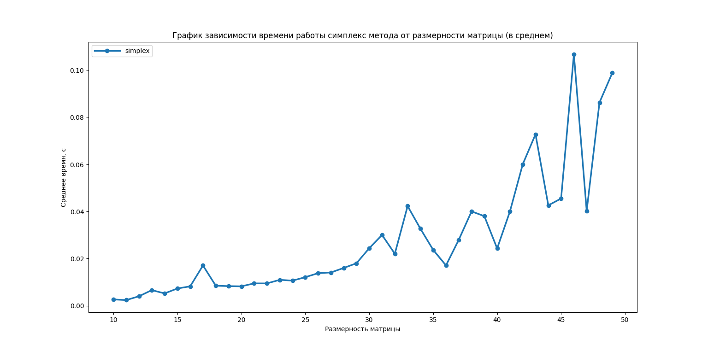

## Solving linear programming problems. Simplex method with tables
* [Description](#description)
* [Get started](#get-started)
* [Project structure](#project-structure)
* [Scheme of Simplex method](#scheme-of-simplex-method)
* [Results](#results)


### Description
Technical Assignments:
- Implement algorithms for solving direct and dual linear programming problems using reference vector and table simplex methods;
- Provide auto-translation of the input linear programming problem into canonical form and dual linear programming problem;
- Provide protection against loops in the simplex-method algorithm (Blend's rule);
- (as part of the course) Output a comment explaining the correspondence between the algorithms of the table simplex method and the one studied in lectures.


Choose the following linear programming problem as the test problem:
- 6 variables 
- 3 equalities "="
- 3 inequalities 
  - 2 <= 
  - 1>=
- 2 variables >=0

### Get started
```bash
git clone https://github.com/IMZolin/simplex-corner-points <your project name>
cd <your project name>
pip install -r requirements.txt
```

### Project structure
```bash
├───graphics            # images:graphics+scheme of simplex
├───out                 # result of compiling .tex file
│   ├───...             # some additional files for .tex
│   └───lab1_opt_methods.pdf # report .pdf
├───report
│   ├───lab1_opt_methods.tex # report .tex
├───src                 # code
│   ├───adapter.py      # task reader
│   ├───corner_dots.py  # corner dots 
│   ├───data.xlsx       # task conditions
│   ├───dual.py         # parse to dual task
│   ├───executable.py   # main(executable) file
│   ├───preprocessing.py # additional functional(make canon form)
│   ├───result_analisys.py # get results
│   └───simplex.py      # simplex method
```

### Scheme of Simplex method


### Results
- The solution to the task at hand

- The graph of the dependence of the method execution time on the dimensionality of the matrix (3,6)

- The graph of the dependence of the method execution time on the dimensionality of the matrix (3,10)

- The graph of the Simplex method execution time dependence on the dimensionality of the matrix on average (10,50)

